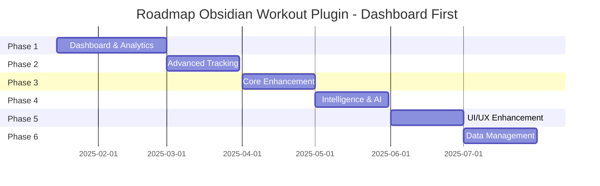

# 🗺️ ROADMAP FINALE - Obsidian Workout Plugin v2.0

## Dashboard-First Development Approach

---

## 📅 **Timeline Generale: Q1 2025 - Q3 2025**



---

## 🎯 **PHASE 1: DASHBOARD & ANALYTICS** [PRIORITY: CRITICAL]

### 🗓️ Gennaio 15 - Febbraio 28, 2025 (6 settimane)

### **Sprint 1-2: Dashboard Core**

#### ✅ **Main Dashboard Layout** [PRIORITY: CRITICAL]

```yaml
Effort: 1 settimana
Layout Components:
  - Summary widget (workouts, streak, volume, PRs)
  - Quick stats cards (settimana/mese/anno)
  - Recent workouts list con preview
  - Progress snapshot
  - Quick actions panel
UI Framework: Native Obsidian components + Chart.js
Status: TODO
```

#### ✅ **Volume Analytics** [PRIORITY: CRITICAL]

```yaml
Effort: 1 settimana
Metriche:
  - Total volume tracking (sets × reps × weight)
  - Volume progression charts
  - Weekly/monthly/yearly volume trends
  - Volume per muscle group breakdown
  - Training density (volume/time)
Visualizzazione: Chart.js interactive graphs
Status: TODO
```

### **Sprint 3-4: Visualizzazioni Avanzate**

#### ✅ **Muscle Heat Map** [PRIORITY: CRITICAL]

```yaml
Effort: 2 settimane
Features:
  - Interactive body visualization (front/back)
  - Color gradient based on training volume
  - Click for muscle group details
  - Weekly/monthly/yearly view toggle
  - Imbalance detection alerts
  - Export as image
Technology: Canvas API + SVG
Status: TODO
```

#### ✅ **Progress Charts Suite** [PRIORITY: HIGH]

```yaml
Effort: 1 settimana
Chart Types:
  - Strength progression (weight over time)
  - Volume progression con trend lines
  - Exercise performance comparison
  - PR timeline visualization
  - Workout frequency calendar heatmap
Library: Chart.js v4.4.0 con custom themes
Status: TODO
```

### **Sprint 5-6: Statistics & Analytics**

#### ✅ **Advanced Statistics Panel** [PRIORITY: HIGH]

```yaml
Effort: 1 settimana
Statistiche:
  - Workout frequency analysis
  - Average workout duration
  - Most/least trained muscles ranking
  - Exercise rotation patterns
  - Peak performance times
  - Weekly/monthly comparisons
Display: Cards + Tables + Mini charts
Export: PDF, CSV, JSON
Status: TODO
```

#### ✅ **Personal Records System** [PRIORITY: HIGH]

```yaml
Effort: 1 settimana
Features:
  - PR tracking per exercise con history
  - PR celebration animations
  - PR timeline con milestones
  - Predicted next PR basato su trend
  - PR comparison charts
  - Export PR achievements to PDF/Image
Database: Automatic PR detection from logs
Status: TODO
```

---

## 💪 **PHASE 2: ADVANCED TRACKING**

### 🗓️ Marzo 1 - Marzo 31, 2025 (4 settimane)

### **Sprint 7-8: Enhanced Logging**

#### ✅ **RPE & Set Types** [PRIORITY: HIGH]

```yaml
Effort: 1 settimana
Componenti:
  - RPE (Rate of Perceived Exertion) 1-10 scale
  - Set types: warmup, working, failure, drop, rest-pause
  - Superset & giant set support
  - AMRAP (As Many Reps As Possible) tracking
  - Partial reps e negative reps
  - Tempo tracking (2-0-2-0 format)
UI: Quick select buttons durante logging
Status: TODO
```

#### ✅ **One Rep Max Calculator** [PRIORITY: HIGH]

```yaml
Effort: 3 giorni
Features:
  - Auto-calcolo 1RM con multiple formule
    - Epley Formula
    - Brzycki Formula
    - Lombardi Formula
  - Tracking storico 1RM per esercizio
  - Estimated vs Tested 1RM comparison
  - Percentuali di lavoro automatiche (70%, 80%, 90%)
  - 1RM progression charts
Integration: Dashboard widget dedicato
Status: TODO
```

### **Sprint 9-10: Body Tracking**

#### ✅ **Body Measurements Tracker** [PRIORITY: MEDIUM]

```yaml
Effort: 1 settimana
Measurements:
  - Weight & body fat percentage
  - Circumferences:
      - Neck, chest, waist, hips
      - Arms (left/right)
      - Thighs (left/right)
      - Calves (left/right)
  - Progress photos management
  - BMI & lean mass calculations
  - Trend analysis with predictions
Charts: Line graphs con multiple Y-axis
Status: TODO
```

#### ✅ **Performance Metrics** [PRIORITY: MEDIUM]

```yaml
Effort: 1 settimana
Tracking:
  - Workout duration trends
  - Rest time between sets
  - Exercise execution speed
  - Recovery time needed
  - Training frequency optimal
Analytics: Pattern recognition per ottimizzazione
Status: TODO
```

---

## 🚀 **PHASE 3: CORE ENHANCEMENT**

### 🗓️ Aprile 1 - Aprile 30, 2025 (4 settimane)

### **Sprint 11-12: Workout Management**

#### ✅ **Workout Templates** [PRIORITY: MEDIUM]

```yaml
Effort: 1 settimana
Features:
  - Create custom workout templates
  - Quick-start from template
  - Template categories (push, pull, legs, full body)
  - Auto-fill sets/reps from last workout
  - Template sharing via export/import
Storage: JSON templates in vault
Status: TODO
```

#### ✅ **Exercise Improvements** [PRIORITY: MEDIUM]

```yaml
Effort: 1 settimana
Updates:
  - Better exercise search/filter
  - Exercise favorites system
  - Quick add recent exercises
  - Exercise notes and cues
  - Video links integration
  - Custom exercise creation
Status: TODO
```

### **Sprint 13-14: System Features**

#### ✅ **Timer System** [PRIORITY: LOW]

```yaml
Effort: 3 giorni
Componenti:
  - Rest timer con countdown
  - Customizable rest periods
  - Audio notifications (optional)
  - Auto-start next set reminder
  - Workout total time tracking
UI: Floating timer widget
Status: TODO
```

#### ✅ **Fatigue Management** [PRIORITY: LOW]

```yaml
Effort: 1 settimana
Monitoring:
  - Training load tracking (volume × intensity)
  - Recovery indicators
  - Overtraining warnings
  - Deload week suggestions
  - Readiness score (basato su performance)
Algorithm: Rolling averages e trend analysis
Status: TODO
```

---

## 🤖 **PHASE 4: INTELLIGENCE & AI**

### 🗓️ Maggio 1 - Maggio 31, 2025 (4 settimane)

### **Sprint 15-16: Smart Features**

#### ✅ **Progression Intelligence** [PRIORITY: MEDIUM]

```yaml
Effort: 2 settimane
Capabilities:
  - Auto-progression suggestions (weight/reps)
  - Plateau detection e alerts
  - Volume optimization recommendations
  - Exercise substitution suggestions
  - Optimal workout frequency analysis
Technology: Statistical analysis + trend detection
Status: TODO
```

#### ✅ **Pattern Recognition** [PRIORITY: LOW]

```yaml
Effort: 1 settimana
Analysis:
  - Best performance conditions (time, day)
  - Exercise pairing effectiveness
  - Recovery patterns
  - Strength gain velocity
  - Muscle group response rates
Output: Insights dashboard panel
Status: TODO
```

### **Sprint 17-18: Predictions & Gamification**

#### ✅ **Predictive Analytics** [PRIORITY: LOW]

```yaml
Effort: 1 settimana
Predictions:
  - Next PR probability
  - Goal achievement timeline
  - Plateau risk assessment
  - Expected strength gains
  - Volume recommendations
Model: Linear regression + moving averages
Status: TODO
```

#### ✅ **Achievement System** [PRIORITY: LOW]

```yaml
Effort: 1 settimana
Achievements:
  - Workout streaks con badges
  - Volume milestones (100kg, 1000kg, etc.)
  - PR badges per exercise
  - Consistency awards
  - Monthly challenges personali
UI: Trophy case in dashboard
Status: TODO
```

---

## 🎨 **PHASE 5: UI/UX ENHANCEMENT**

### 🗓️ Giugno 1 - Giugno 30, 2025 (4 settimane)

### **Sprint 19-20: Mobile Optimization**

#### ✅ **Mobile-First Interface** [PRIORITY: HIGH]

```yaml
Effort: 2 settimane
Features:
  - Responsive dashboard per mobile
  - Touch-optimized controls
  - Swipe gestures per navigation
  - Large buttons per uso in palestra
  - Quick-log interface semplificata
  - Portrait/landscape support
Platform: Obsidian Mobile App
Status: TODO
```

#### ✅ **Workout Mode UI** [PRIORITY: HIGH]

```yaml
Effort: 1 settimana
Components:
  - Full-screen workout view
  - Large number inputs
  - Easy weight/reps adjustment (+/- buttons)
  - Current exercise highlight
  - Progress bar per workout
  - Minimal distractions mode
Status: TODO
```

### **Sprint 21-22: Customization**

#### ✅ **Theme System** [PRIORITY: LOW]

```yaml
Effort: 1 settimana
Features:
  - Light/Dark theme optimization
  - Custom color schemes per charts
  - Font size accessibility
  - Dashboard layout options (grid/list)
  - Widget visibility toggles
  - Custom CSS injection support
Status: TODO
```

---

## 📂 **PHASE 6: DATA MANAGEMENT**

### 🗓️ Luglio 1 - Luglio 31, 2025 (4 settimane)

### **Sprint 23-24: Export & Import**

#### ✅ **Advanced Export System** [PRIORITY: HIGH]

```yaml
Effort: 1 settimana
Export Formats:
  - CSV completo con tutti i dati
  - JSON per backup/migration
  - PDF reports con grafici
  - HTML dashboard standalone
  - Excel files (.xlsx)
  - Markdown summary reports
Features: Date range selection, data filtering
Status: TODO
```

#### ✅ **Import & Migration** [PRIORITY: HIGH]

```yaml
Effort: 1 settimana
Import From:
  - Strong app (CSV)
  - Hevy (CSV)
  - FitNotes (CSV)
  - Generic CSV con mapping
  - Previous plugin versions
Features: Data validation, duplicate detection
Status: TODO
```

### **Sprint 25-26: Backup & Reports**

#### ✅ **Backup System** [PRIORITY: MEDIUM]

```yaml
Effort: 1 settimana
Features:
  - Automatic daily backups
  - Version history (30 days)
  - Backup to vault folder
  - Restore from backup
  - Data integrity checks
Storage: ZIP archives con timestamp
Status: TODO
```

#### ✅ **Report Generation** [PRIORITY: MEDIUM]

```yaml
Effort: 1 settimana
Reports:
  - Monthly progress summary
  - Annual review
  - Exercise analysis reports
  - Body composition trends
  - Custom date range reports
Format: Interactive HTML + PDF
Status: TODO
```

---

## 📈 **Release Schedule**

### **v2.0 - Dashboard First Release**

**📅 Target: Marzo 2025**

- ✅ Complete dashboard suite
- ✅ Muscle heat map
- ✅ Volume analytics
- ✅ Progress charts
- ✅ Statistics panel

### **v2.1 - Enhanced Tracking Release**

**📅 Target: Aprile 2025**

- ✅ RPE & advanced sets
- ✅ 1RM calculator
- ✅ Body measurements
- ✅ Performance metrics

### **v2.2 - Smart Features Release**

**📅 Target: Maggio 2025**

- ✅ Workout templates
- ✅ Progression intelligence
- ✅ Pattern recognition
- ✅ Achievement system

### **v2.3 - Professional Edition**

**📅 Target: Luglio 2025**

- ✅ Mobile optimization
- ✅ Advanced export/import
- ✅ Backup system
- ✅ Report generation
- ✅ Theme customization

---

## 🎯 **Success Metrics**

| Metric              | Target           | Priority |
| ------------------- | ---------------- | -------- |
| Dashboard Load Time | < 1.5s           | CRITICAL |
| Chart Render Time   | < 500ms          | HIGH     |
| Data Accuracy       | 100%             | CRITICAL |
| Mobile Usability    | 95% satisfaction | HIGH     |
| Export Success Rate | 100%             | HIGH     |
| User Retention      | 80% at 30 days   | MEDIUM   |

---

## 🏗️ **Technical Stack**

```yaml
Core:
  - TypeScript 5.0+
  - Obsidian API latest
  - Chart.js 4.4.0
  - Canvas API for heat maps

Storage:
  - CSV for workout logs (existing)
  - JSON for settings/templates
  - IndexedDB for cache
  - Local file system

Performance:
  - Lazy loading for charts
  - Data pagination
  - Debounced calculations
  - Virtual scrolling for tables

Testing:
  - Unit tests for calculations
  - Integration tests for data flow
  - Manual testing on mobile
```

---

## ❌ **Features RIMOSSE dalla Roadmap**

```yaml
Removed Features:
  - Exercise Database (già esistente)
  - Nutrition Integration (non richiesto)
  - Program Templates Library (non richiesto)
  - Workout Builder 2.0 (non richiesto)
  - Social features (impossibile)
  - Health app sync (impossibile)
  - Wearables support (impossibile)
  - Cloud sync (use Obsidian Sync)
```

---

## 📝 **Development Priorities**

### **CRITICAL (Da fare subito)**

1. Dashboard Layout
2. Volume Analytics
3. Muscle Heat Map
4. Progress Charts

### **HIGH (Importante)**

1. Statistics Panel
2. Personal Records
3. RPE & Set Types
4. 1RM Calculator
5. Mobile Interface
6. Export/Import System

### **MEDIUM (Nice to have)**

1. Body Measurements
2. Workout Templates
3. Progression Intelligence
4. Backup System
5. Reports

### **LOW (Opzionale)**

1. Timer System
2. Fatigue Management
3. Pattern Recognition
4. Achievements
5. Theme System

---

## 🎉 **Vision Statement**

> "Creare il più potente sistema di analytics per fitness in Obsidian,
> con una dashboard professionale che trasforma i dati in insights azionabili,
> mantenendo la semplicità d'uso e la filosofia privacy-first di Obsidian."

---

_Last Updated: January 2025_
_Version: FINAL_
_Status: READY FOR DEVELOPMENT_
