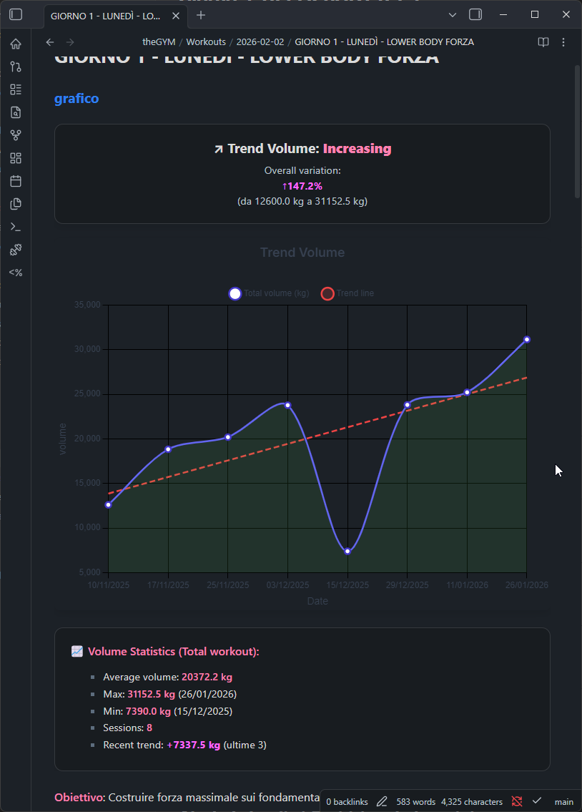
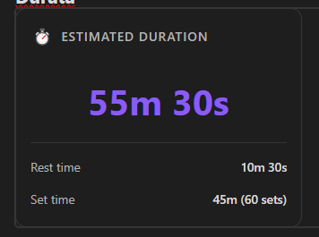
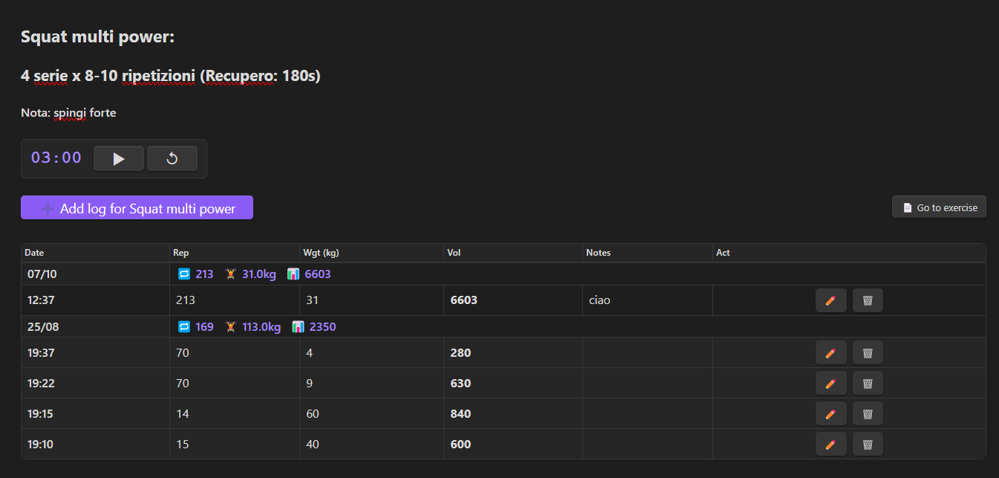
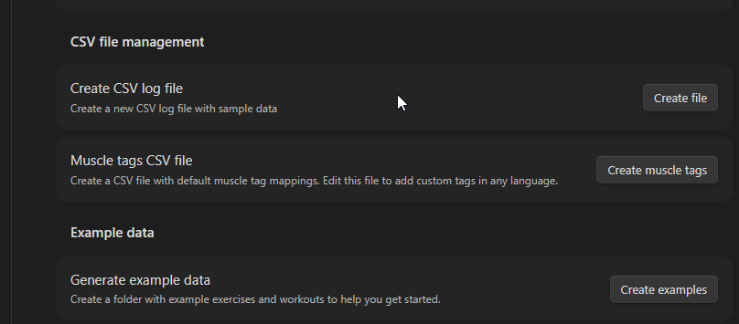

# Workout Planner Plugin

A comprehensive plugin for Obsidian that visualizes workout data with interactive charts, tables, and timers. This plugin converts your workout log files into beautiful visualizations and provides tools to track your fitness progress over time.

## Quick Start

Want to see all features in action? Go to **Settings → Workout Planner** and click the **Create Example** button. This creates a demo folder with sample workout data and notes showcasing all plugin features including charts, tables, timers, and dashboards.

## Features

- **Interactive Charts**: View your workout data in various chart types using Chart.js
  - **Strength Training**: Volume, Weight, Reps
  - **Cardio & Endurance**: Duration, Distance, Pace, Heart Rate
  - Smart formatting: duration as "1h 30m", pace as "5:30 min/km"
  - Intelligent trend indicators: pace improvements shown correctly (lower = faster = better)



- **Data Tables**: Display workout logs in organized, sortable tables
- **Workout Timers**: Built-in timers for tracking rest periods and workout sessions
- **Advanced Search**: Intelligent exercise matching with multiple search strategies
- **Data Parsing**: Automatically reads workout log files from your specified folder
- **Real-time Updates**: Refresh charts and tables to see your latest workout data
- **Customizable Settings**: Configure chart types, date ranges, and display options
- **Log Creation**: Create new workout logs directly from the plugin
- **Exercise Management**: Create exercise pages and sections for better organization
- **Trend Lines**: Visualize progress trends with automatic trend line calculation
- **Responsive Design**: Works on desktop and mobile devices
- **Code Block Integration**: Embed charts, tables, and timers directly in your notes

### New Features (v1.0.27)

- **Quick Log Modal**: Fast workout logging with touch-friendly UI for mobile devices
  - Recent exercises quick select
  - Weight auto-fill with quick adjustment buttons
  - Ribbon icon for quick access
- **Protocol Tracking**: Track advanced training techniques (drop sets, supersets, etc.)
  - Custom protocol definitions in settings
  - Protocol filtering and badges in tables
  - Protocol distribution and effectiveness dashboard widgets
- **Duration Estimation**: Estimate and compare workout durations
  - Duration comparison widget showing actual vs. estimated time
  - Set duration settings for accurate estimation
  - `workout-duration` code block for embedding

  

- **Canvas Export**: Visualize workout structure on Obsidian Canvas
  - Export exercises and workout structure as canvas nodes
  - Layout configuration options
- **Dynamic Exercise Types**: Define custom exercise types with specific fields
  - Built-in types: Strength, Cardio, Flexibility
  - Custom field definitions per exercise type
  - Automatic column management based on type
- **Exercise Conversion**: Convert exercises between different types
  - Field mapping for data preservation
  - Preview changes before conversion
- **Dataview Integration**: Query workout logs with Dataview
  - Exercise statistics API
  - Workout log queries
- **Templater Integration**: Use workout data in templates
  - `workoutExercises` function for exercise lists
  - `workoutExerciseBlock` for template integration

## How it Works

The plugin reads workout log data from a single CSV file in your vault. This file stores all your workout entries and is used to generate charts and tables.

## Usage

### Available Commands

The plugin provides several commands accessible through the Command Palette (Ctrl/Cmd + P):

- **Create Workout Log**: Create a new workout log entry
- **Create Log Folder**: Create the default log folder if it doesn't exist
- **Insert Workout Chart**: Insert a chart code block into your current note
- **Insert Workout Table**: Insert a table code block into your current note
- **Insert Workout Timer**: Insert a timer code block into your current note
- **Create Exercise Page**: Create a new page for an exercise
- **Create Exercise Section**: Create a new section for an exercise

### Creating Workout Logs

1. Use the command palette: "Create Workout Log"
2. Fill in the exercise name, reps, weight, and other details
3. The plugin will create a new log file in your specified folder



### Using Code Blocks

The plugin supports three types of code blocks that you can embed directly in your notes:

#### Workout Charts

```workout-chart
exercise: Squat
type: volume
dateRange: 30
showTrendLine: true
showStats: true
```

For cardio exercises:

```workout-chart
exercise: Running
type: pace
dateRange: 30
showTrendLine: true
showStats: true
```

#### Workout Tables

```workout-log
exercise: Bench Press
exactMatch: false
dateRange: 14
```

#### Workout Timers

```workout-timer
duration: 90
label: Rest Period
autoStart: false
```

### Code Block Parameters

#### Chart Parameters

- `exercise`: Exercise name to filter (optional)
- `type`: Type of data to display:
  - **Strength**: `volume`, `weight`, `reps`
  - **Cardio**: `duration`, `distance`, `pace`, `heartRate`
- `dateRange`: Number of days to include (default: 30)
- `showTrendLine`: Enable trend line (true/false)
- `showStats`: Show statistics box with avg/max/min values (true/false)
- `height`: Chart height in pixels

> **Note**: For pace charts, trend indicators use inverted logic - a decreasing pace (getting faster) is shown as "Improving" with green coloring, while an increasing pace (getting slower) is shown as "Declining" with red coloring.

#### Table Parameters

- `exercise`: Exercise name to filter (optional)
- `exactMatch`: Use exact matching for exercise names (true/false)
- `dateRange`: Number of days to include
- `sortBy`: Sort field (Date, Exercise, Weight, Reps, Volume)
- `sortOrder`: Sort order (asc, desc)

#### Timer Parameters

- `duration`: Timer duration in seconds
- `label`: Timer label
- `autoStart`: Start timer automatically (true/false)
- `sound`: Enable sound notifications (true/false)

### Advanced Search Features

The plugin includes an intelligent search system that can find exercises even with variations in naming:

- **Multiple Search Strategies**:
  - Filename matching
  - Exercise field matching
  - Automatic strategy selection based on match scores
- **Fuzzy Matching**: Finds exercises with similar names
- **Score-based Filtering**: Uses confidence scores to determine best matches
- **Debug Information**: Shows which search strategy was used

## Custom Muscle Tags

The plugin supports custom muscle tag mappings, allowing you to create tags in any language and map them to canonical muscle groups. This is useful for the muscle heatmap visualization and exercise categorization.

### Managing Muscle Tags

Use the command palette (Ctrl/Cmd + P) and search for:

- **Workout: Manage muscle tags** - Opens the tag manager modal
- **Workout: Generate tag reference note** - Creates a reference note listing all your tags

### Tag Manager Modal

The tag manager modal allows you to:

- **View all tags**: See all muscle tags and their mapped muscle groups
- **Search**: Filter tags by name or muscle group
- **Add new tags**: Create custom tags mapped to canonical muscle groups
- **Edit tags**: Modify the muscle group mapping for existing tags
- **Delete tags**: Remove tags you no longer need
- **Fuzzy matching**: When adding tags, similar existing tags are suggested to prevent duplicates

### Import/Export

- **Export**: Download your tags as a CSV file for backup
- **Import**: Load tags from a CSV file with options to:
  - **Merge**: Add only new tags, keeping existing ones
  - **Replace**: Overwrite all existing tags with imported ones

### CSV File Format

Tags are stored in `muscle-tags.csv` in the same folder as your workout log CSV. The format is:

```csv
tag,muscleGroup
petto,chest
schiena,back
spalle,shoulders
```

### Canonical Muscle Groups

Tags must map to one of these canonical muscle groups:

| Group        | Description                 |
| ------------ | --------------------------- |
| `chest`      | Pectorals                   |
| `back`       | Latissimus dorsi, rhomboids |
| `shoulders`  | Deltoids (front/side)       |
| `biceps`     | Biceps brachii              |
| `triceps`    | Triceps brachii             |
| `quads`      | Quadriceps                  |
| `hamstrings` | Hamstring muscles           |
| `glutes`     | Gluteus muscles             |
| `calves`     | Calf muscles                |
| `abs`        | Abdominal muscles           |
| `core`       | Core stabilizers            |
| `forearms`   | Forearm muscles             |
| `traps`      | Trapezius                   |
| `rear_delts` | Posterior deltoids          |

### Creating Default Tags

In plugin settings under "CSV Management", use the **Create muscle tags** button to generate a CSV file with default tag mappings (English and Italian).



## Settings

- **CSV Log File Path**: Path to your workout log CSV file (default: `theGYM/Log/workout_logs.csv`).
- **Default Exercise**: Default exercise to show in charts.
- **Chart Type**: Default chart type (volume, weight, reps, duration, distance, pace, heartRate).
- **Date Range**: Number of days to include in charts (default: 30).
- **Show Trend Line**: Enable trend line visualization.
- **Chart Height**: Height of charts in pixels (default: 400).
- **Debug Mode**: Enable debug logging for troubleshooting.

## Data Format

The plugin uses a single CSV file to store all workout logs. The file must have the following header row:

`date,exercise,reps,weight,volume,origine,workout,timestamp`

- **date**: The date of the workout in ISO 8601 format (`YYYY-MM-DDTHH:mm:ss.sssZ`).
- **exercise**: The name of the exercise.
- **reps**: Number of repetitions.
- **weight**: Weight used.
- **volume**: Calculated volume (reps \* weight).
- **origine**: The source or workout routine (e.g., "Push Day"). Can be a link.
- **workout**: (Optional) Can be used for additional workout details.
- **timestamp**: The unique timestamp of the log entry (milliseconds since epoch).

### Example CSV Content

```csv
date,exercise,reps,weight,volume,origine,workout,timestamp
2025-01-17T10:30:00.000Z,Bench Press,8,100,800,[[Push Day]],Workout A,1737138600000
2025-01-17T10:35:00.000Z,Squat,10,80,800,[[Leg Day]],Workout A,1737138900000
```

## API Documentation

See https://github.com/obsidianmd/obsidian-api

## Third-Party Libraries

This plugin uses the following third-party libraries:

- **Chart.js** (v4.4.0) - For interactive chart rendering
  - License: MIT
  - Repository: https://github.com/chartjs/Chart.js

## License

This plugin is licensed under the MIT License. See the [LICENSE](LICENSE) file for details.
