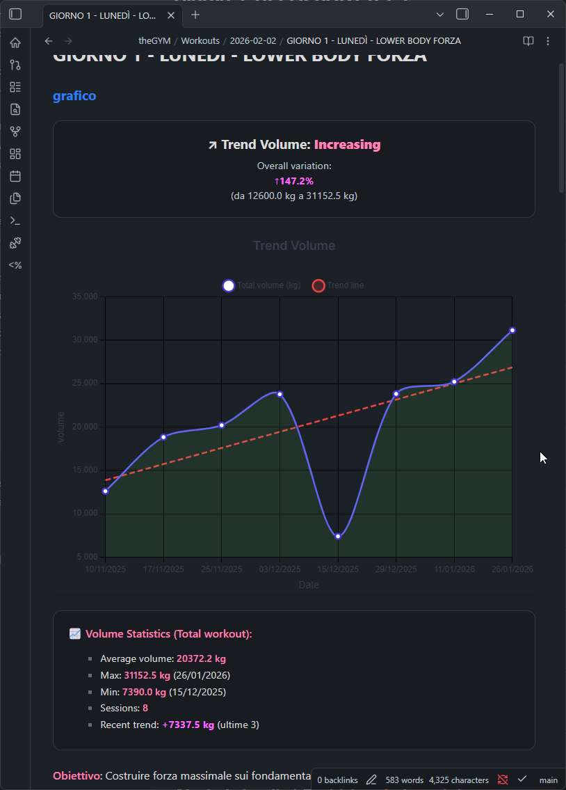

# Workout Planner Plugin

  

A comprehensive plugin for Obsidian that visualizes workout data with interactive charts, tables, and timers. Store your logs in a single CSV file and get beautiful visualizations, progress tracking, and duration estimation directly inside your notes.

## Quick Start

Go to **Settings → Workout Planner** and click **Create examples** to generate a demo folder with sample workout data and notes showcasing all plugin features — charts, tables, timers, and dashboards.

---

## Features

- **Interactive Charts** — Volume, weight, reps, duration, distance, pace, heart rate via Chart.js
  - Smart formatting: duration as `1h 30m`, pace as `5:30 min/km`
  - Trend lines with inverted logic for pace (lower = faster = improving)
- **Data Tables** — Sortable logs with edit/delete, protocol badges, progressive overload targets
- **Workout Timers** — Countdown, interval, and stopwatch with presets and audio notifications
- **Workout Dashboard** — Stats, muscle heat map, recent workouts, volume analytics, protocol effectiveness
- **Quick Log** — Touch-friendly modal for fast logging with recent exercises and weight adjustment buttons
- **Protocol Tracking** — Custom training techniques (drop sets, supersets, myo-reps, etc.) with badge display
- **Duration Estimation** — Compare actual vs. estimated workout duration
- **Canvas Export** — Visualize workout structure on Obsidian Canvas
- **Dynamic Exercise Types** — Strength, Cardio, Flexibility with custom field definitions
- **Exercise Conversion** — Convert exercises between types with field mapping
- **Custom Muscle Tags** — Map tags in any language to canonical muscle groups
- **Dataview Integration** — Public API for querying logs and stats from Dataview queries
- **Templater Integration** — Use workout data in templates
- **Responsive Design** — Works on desktop and mobile



---

## Usage

### Commands

Access via Command Palette (`Ctrl/Cmd + P`):

| Command | Description |
|---------|-------------|
| Create Workout Log | Open the log creation modal |
| Quick Log | Fast entry with touch-friendly UI |
| Insert Workout Chart | Insert a `workout-chart` code block |
| Insert Workout Table | Insert a `workout-log` code block |
| Insert Workout Timer | Insert a `workout-timer` code block |
| Create Exercise Page | Create a new exercise page |
| Create Exercise Section | Add an exercise block to a note |
| Manage muscle tags | Open the muscle tag manager |
| Generate tag reference note | Create a reference note for all tags |

### Code Blocks

Embed charts, tables, timers, and dashboards directly in your notes using code blocks.

#### workout-chart

```workout-chart
exercise: Squat
type: volume
dateRange: 30
showTrendLine: true
showStats: true
height: 400
```

**Parameters:**

| Parameter | Type | Default | Description |
|-----------|------|---------|-------------|
| `exercise` | string | — | Exercise name to filter (optional) |
| `type` | string | `volume` | `volume`, `weight`, `reps`, `duration`, `distance`, `pace`, `heartRate` |
| `dateRange` | number | `30` | Days to include |
| `showTrendLine` | boolean | `true` | Display trend line |
| `showStats` | boolean | `false` | Show avg/max/min stats box |
| `height` | number | `400` | Chart height in pixels |

> **Pace charts**: trend logic is inverted — decreasing pace (faster) = Improving (green), increasing pace (slower) = Declining (red).

#### workout-log

```workout-log
exercise: Bench Press
exactMatch: false
dateRange: 14
sortBy: date
sortOrder: desc
limit: 50
```

**Parameters:**

| Parameter | Type | Default | Description |
|-----------|------|---------|-------------|
| `exercise` | string | — | Exercise name to filter |
| `exactMatch` | boolean | `true` | Exact vs. fuzzy matching |
| `dateRange` | number | — | Days to include |
| `sortBy` | string | `date` | `date`, `exercise`, `weight`, `reps`, `volume` |
| `sortOrder` | string | `desc` | `asc` or `desc` |
| `limit` | number | `50` | Maximum rows to display |
| `columns` | array | all | Visible columns, e.g. `["date","reps","weight"]` |

#### workout-timer

```workout-timer
duration: 90
label: Rest Period
autoStart: false
sound: true
preset: rest
```

**Parameters:**

| Parameter | Type | Description |
|-----------|------|-------------|
| `duration` | number | Duration in seconds |
| `label` | string | Timer label |
| `autoStart` | boolean | Start automatically on render |
| `sound` | boolean | Play audio on completion |
| `preset` | string | Use a saved preset by name |

#### workout-dashboard

```workout-dashboard
```

No parameters — renders the full dashboard with all widgets.

---

## Settings

### Setup & data

| Setting | Description |
|---------|-------------|
| CSV log file path | Folder where `workout_logs.csv` and `muscle-tags.csv` are stored |
| Exercise folder path | Path to the folder containing exercise pages |
| Weight unit | `kg` or `lb` — affects all views and new log defaults |
| Setup CSV files | Creates both CSV files in the configured folder |
| Generate example data | Creates a demo folder with sample workouts |

### Mobile logging

| Setting | Description |
|---------|-------------|
| Default exact match | When enabled, exercise filtering uses exact name matching by default |
| Quick weight increment | Weight step for +/- buttons in create/edit log modals (e.g., `2.5`) |

### Timer presets

Save reusable timer configurations (countdown, interval, stopwatch) with name, duration, rounds, sound, and controls settings. Set a default preset for new timers.

### Custom protocols

Define custom training techniques beyond the built-in ones. Each protocol has a name, abbreviation (max 3 chars), and badge color. Protocols appear as badges in tables and dashboard widgets.

### Training parameters

| Setting | Description |
|---------|-------------|
| Weight increment | Default weight step for progressive overload suggestions |
| Duration per repetition | Seconds per rep — used when rep count is known |
| Default reps per set | Assumed reps when not specified (0 = use fallback set duration) |
| Fallback set duration | Seconds per set when reps are not available (default: 45s) |

### Advanced

| Setting | Description |
|---------|-------------|
| Exercise block template | Template inserted when creating exercise blocks via modal |
| Run all maintenance | Runs migration tasks (block IDs, exercise type upgrades) |

---

## Custom Muscle Tags

Map custom tags (in any language) to canonical muscle groups for the heatmap and exercise categorization.

### Tag Manager

Open via Command Palette → **Workout: Manage muscle tags**. Supports add, edit, delete, search, and fuzzy duplicate detection.

### CSV Format

Tags are stored in `muscle-tags.csv` alongside your workout log:

```csv
tag,muscleGroup
petto,chest
schiena,back
spalle,shoulders
```

### Canonical Muscle Groups

`chest`, `back`, `shoulders`, `biceps`, `triceps`, `quads`, `hamstrings`, `glutes`, `calves`, `abs`, `core`, `forearms`, `traps`, `rear_delts`

---

## Data Format

All workout logs are stored in a single CSV file:

```
date,exercise,reps,weight,volume,origine,workout,timestamp,notes,protocol
```

| Column | Description |
|--------|-------------|
| `date` | ISO 8601 datetime (`YYYY-MM-DDTHH:mm:ss.sssZ`) |
| `exercise` | Exercise name |
| `reps` | Repetitions |
| `weight` | Weight used |
| `volume` | Calculated volume (`reps × weight`) |
| `origine` | Source or workout routine (supports Obsidian links) |
| `workout` | Workout name |
| `timestamp` | Unique entry identifier (ms since epoch) |
| `notes` | Optional notes |
| `protocol` | Training protocol (e.g., `drop_set`, `standard`) |

Custom exercise types add extra columns automatically (e.g., `duration`, `distance`, `pace`).

### Example

```csv
date,exercise,reps,weight,volume,origine,workout,timestamp,notes,protocol
2025-01-17T10:30:00.000Z,Bench Press,8,100,800,[[Push Day]],Workout A,1737138600000,,standard
2025-01-17T10:35:00.000Z,Squat,10,80,800,[[Leg Day]],Workout A,1737138900000,,standard
```

---

## Dataview Integration

The plugin exposes `window.WorkoutPlannerAPI` for use in Dataview queries and other plugins.

### Methods

#### `getWorkoutLogs(filter?)`

```javascript
const logs = await WorkoutPlannerAPI.getWorkoutLogs({
  exercise: "Squat",           // partial match, case-insensitive
  workout: "Push Day",
  dateRange: { start: "2025-01-01", end: "2025-01-31" },
  protocol: "drop_set",
  exactMatch: false,
});
```

Returns: `date`, `exercise`, `reps`, `weight`, `volume`, `workout`, `notes`, `timestamp`, `protocol`

#### `getExerciseStats(exercise)`

```javascript
const stats = await WorkoutPlannerAPI.getExerciseStats("Bench Press");
// { totalVolume, maxWeight, prWeight, prReps, prDate, totalSets,
//   averageWeight, averageReps, lastWorkoutDate, trend }
```

#### `getExercises(filter?)`

```javascript
const exercises = await WorkoutPlannerAPI.getExercises({ tag: "chest" });
```

### Examples

**Recent logs table:**

```dataviewjs
const logs = await WorkoutPlannerAPI.getWorkoutLogs({
  exercise: "Squat",
  dateRange: { start: "2025-01-01" }
});
dv.table(
  ["Date", "Reps", "Weight", "Volume"],
  logs.map(l => [l.date.split("T")[0], l.reps, l.weight + " kg", l.volume])
);
```

**Exercise PR:**

```dataviewjs
const stats = await WorkoutPlannerAPI.getExerciseStats("Bench Press");
dv.paragraph(`**PR:** ${stats.prWeight} kg × ${stats.prReps} reps (${stats.prDate})`);
```

**Weekly volume:**

```dataviewjs
const logs = await WorkoutPlannerAPI.getWorkoutLogs({
  dateRange: {
    start: moment().subtract(7, "days").format("YYYY-MM-DD"),
    end: moment().format("YYYY-MM-DD")
  }
});
const volume = logs.reduce((sum, l) => sum + l.volume, 0);
dv.paragraph(`**This week:** ${volume.toLocaleString()} kg total volume`);
```

> The API is available after the plugin loads. Access as `WorkoutPlannerAPI` or `window.WorkoutPlannerAPI`.

---

## Translations

> ⚠️ All translations except English are generated via AI (LLM-based machine translation). Some may contain errors or unnatural phrasing. Feel free to open an issue or PR with corrections.

---

## Third-Party Libraries

- **Chart.js** v4.4.0 — MIT — [github.com/chartjs/Chart.js](https://github.com/chartjs/Chart.js)

---

## License

MIT License — see [LICENSE](LICENSE) for details.
