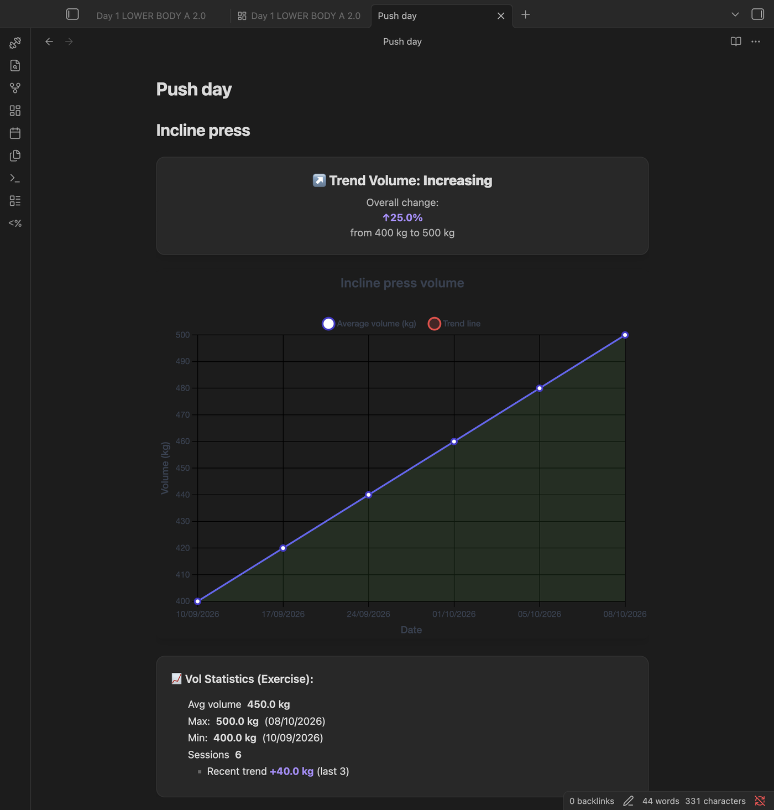

# Workout Planner for Obsidian

 

Log your sets in Obsidian and see your progress in the same notes you plan your training in. Workout Planner keeps every set in one CSV file in your vault, then draws tables, charts, timers and a dashboard (with a muscle heat map) wherever you put a code block.

It works on desktop and mobile, so you can log from your phone between sets.



## Contents

- [Install](#install)
- [Your first workout in five minutes](#your-first-workout-in-five-minutes)
- [How it fits together](#how-it-fits-together)
- [Logging sets](#logging-sets)
- [Seeing your progress](#seeing-your-progress)
- [Code block reference](#code-block-reference)
- [Exercise pages](#exercise-pages)
- [Muscle tags and the heat map](#muscle-tags-and-the-heat-map)
- [Commands](#commands)
- [Settings](#settings)
- [Your data](#your-data)
- [Dataview and Templater](#dataview-and-templater)
- [Troubleshooting](#troubleshooting)

## Install

1. In Obsidian, open **Settings → Community plugins → Browse**.
2. Search for **Workout Planner**, then select **Install** and **Enable**.

To install by hand, download `main.js`, `manifest.json` and `styles.css` from the [latest release](https://github.com/SpatariuRares/obsidian-workout-plugin/releases/latest) into `<your vault>/.obsidian/plugins/workout-planner/`.

## Your first workout in five minutes

The quickest way to see everything working is the example folder. Go to **Settings → Workout Planner** and select **Create examples**. You get sample exercises, a few workouts with a month of logs, and a dashboard. Open them and look around.

To start with your own data instead:

1. In **Settings → Workout Planner**, set the CSV folder (where your logs go) and the exercise folder (where your exercise pages go), then select **Create files**.
2. Make a note called `Push Day` and add a table for one exercise:

   ````markdown
   ```workout-log
   exercise: Bench Press
   ```
   ````

3. Select the **+** button under the table (or the dumbbell icon in the ribbon, or the **Create workout log** command). Enter reps and weight and save. The table updates on its own.
4. Once you have a few sessions, add a chart under the table:

   ````markdown
   ```workout-chart
   exercise: Bench Press
   type: weight
   ```
   ````

## How it fits together

There are three kinds of files:

| What           | Where                                       | What it does                                                                                                                                           |
| -------------- | ------------------------------------------- | ------------------------------------------------------------------------------------------------------------------------------------------------------ |
| The log        | `workout_logs.csv` in your CSV folder       | One row per set. Every view reads from here.                                                                                                           |
| Exercise pages | Your exercise folder, one note per exercise | Say what kind of exercise it is (so the log form asks for the right fields) and which muscles it trains (for the heat map). Optional, but recommended. |
| Your notes     | Anywhere                                    | Workout plans, journals, dashboards. You add code blocks to them to show tables, charts, timers and stats.                                             |

When you log a set from a note, the note's name is saved as the set's **workout**. That's how `workout: Push Day` filters work later.

## Logging sets

Open the log form in any of these ways:

- the **+** button under a `workout-log` table (it fills in the exercise for you)
- the dumbbell icon in the ribbon
- the **Create workout log** command

The form shows recent exercises as one-tap chips and has **+/−** buttons for weight, which helps on a phone. It asks for the fields that fit the exercise: reps and weight for a squat, seconds for a plank, distance and time for a run (see [Exercise pages](#exercise-pages)).

Each set can also carry:

- notes, as free text
- a protocol, the training technique shown as a badge: standard, drop set, myo-reps, rest-pause, superset, 21s, or [your own](#settings)

To change or delete a set, use the buttons on its row in a table.

## Seeing your progress

| You want to…                                                              | Use                                                                                        |
| ------------------------------------------------------------------------- | ------------------------------------------------------------------------------------------ |
| See every set of an exercise or workout                                   | [`workout-log`](#workout-log) table                                                        |
| See a lift go up over time                                                | [`workout-chart`](#workout-chart) with `type: weight` or `volume`                          |
| Track runs, rides, planks                                                 | [`workout-chart`](#workout-chart) with `type: duration`, `distance`, `pace` or `heartRate` |
| Get an overview: totals, recent workouts, muscles trained, protocol stats | [`workout-dashboard`](#workout-dashboard)                                                  |
| Time your rest                                                            | [`workout-timer`](#workout-timer)                                                          |
| Know how long a planned workout takes                                     | [`workout-duration`](#workout-duration)                                                    |
| Lay out a workout on a canvas                                             | **Export workout to canvas** command                                                       |

You don't have to write code blocks by hand: the **Insert workout chart / table / timer / dashboard / duration** commands open a form and insert the block for you.

## Code block reference

Every parameter is optional. Exercise names match loosely by default ("squat" finds "Squat (high bar)"); add `exactMatch: true` when you want only that exact name.

### workout-log

A table of sets, newest first, with edit and delete buttons.

```workout-log
exercise: Bench Press
dateRange: 14
limit: 20
```

| Parameter                    | Default | What it does                                       |
| ---------------------------- | ------- | -------------------------------------------------- |
| `exercise`                   | —       | Only this exercise                                 |
| `workout`                    | —       | Only this workout (note name)                      |
| `exactMatch`                 | `false` | Match the exercise name exactly                    |
| `dateRange`                  | all     | Today and the previous N days                      |
| `limit`                      | `50`    | Maximum rows                                       |
| `sortBy`                     | `date`  | `date`, `exercise`, `weight`, `reps` or `volume`   |
| `sortOrder`                  | `desc`  | `asc` or `desc`                                    |
| `columns`                    | all     | Columns to show, e.g. `["date", "reps", "weight"]` |
| `showProtocol`               | `true`  | Show the protocol badge column                     |
| `showAddButton`              | `true`  | Show the **+** button                              |
| `targetWeight`, `targetReps` | —       | Show a progressive-overload target above the table |

### workout-chart

A line chart for one measure over time.

```workout-chart
exercise: Squat
type: volume
dateRange: 90
showTrendLine: true
```

| Parameter       | Default        | What it does                                                              |
| --------------- | -------------- | ------------------------------------------------------------------------- |
| `exercise`      | —              | Only this exercise                                                        |
| `workout`       | —              | Only this workout                                                         |
| `type`          | `volume`       | `volume`, `weight`, `reps`, `duration`, `distance`, `pace` or `heartRate` |
| `chartType`     | `exercise`     | How each day's point is built (below)                                     |
| `dateRange`     | `30`           | Days to include                                                           |
| `limit`         | —              | Only the latest N points                                                  |
| `showTrendLine` | `false`        | Draw a trend line                                                         |
| `showStats`     | `true`         | Show average, best and lowest under the chart                             |
| `title`         | `Trend <type>` | Chart title                                                               |
| `height`        | 4:3            | `300` (pixels) or any CSS length such as `50vh`                           |
| `exactMatch`    | `false`        | Match the exercise name exactly                                           |

`chartType` picks which sets count and how a day becomes one point:

| `chartType` | Sets used                           | Each day's point |
| ----------- | ----------------------------------- | ---------------- |
| `exercise`  | sets of `exercise`                  | average          |
| `workout`   | sets of `workout`                   | total            |
| `combined`  | sets of `exercise` within `workout` | total            |
| `all`       | every set (filters ignored)         | total            |

For pace, lower is better, so a falling line is shown as improving.

### workout-dashboard

Summary cards, quick stats, volume trend, recent workouts, a muscle heat map, protocol usage and effectiveness, and planned vs. actual workout length.

```workout-dashboard
title: Last three months
dateRange: 90
```

| Parameter                                                                                        | Default | What it does                   |
| ------------------------------------------------------------------------------------------------ | ------- | ------------------------------ |
| `title`                                                                                          | —       | Heading above the dashboard    |
| `dateRange`                                                                                      | all     | Only sets from the last N days |
| `showSummary`, `showQuickStats`, `showVolumeAnalytics`, `showRecentWorkouts`, `showQuickActions` | `true`  | Hide a section with `false`    |
| `recentWorkoutsLimit`                                                                            | `5`     | Workouts in the recent list    |
| `volumeTrendDays`                                                                                | `30`    | Days in the volume trend chart |

The heat map has buttons for the period (week, month, year), the side of the body, and what to measure: **Volume** (reps × weight), **Sets** or **Reps**. Bodyweight and timed exercises have no weight, so they only light up under Sets and Reps.

### workout-timer

```workout-timer
type: countdown
duration: 90
```

| Parameter             | Default     | What it does                                                                              |
| --------------------- | ----------- | ----------------------------------------------------------------------------------------- |
| `type`                | `countdown` | `countdown`, `interval` or `stopwatch`                                                    |
| `duration`            | `30`        | Seconds (countdown and interval)                                                          |
| `rounds`              | `1`         | Rounds (interval)                                                                         |
| `sound`               | `true`      | Beep when time is up                                                                      |
| `autoStart`           | `false`     | Start as soon as the note opens                                                           |
| `showControls`        | `true`      | Show start, pause and reset                                                               |
| `preset`              | —           | Start from a saved preset; other parameters override it                                   |
| `exercise`, `workout` | —           | Restart the timer when you log a set for this exercise or workout, handy for rest periods |

On a phone, the browser only allows sound after you've tapped **Start** once, so a timer started by `autoStart` stays silent until then.

### workout-duration

Estimates how long a workout note takes: rest from its `workout-timer` blocks plus time for each set.

```workout-duration
workout: Workouts/Push Day.md
```

| Parameter | Default   | What it does                         |
| --------- | --------- | ------------------------------------ |
| `workout` | this note | Path of the workout note to estimate |

Seconds per rep and per set come from [Settings → Training parameters](#settings).

## Exercise pages

An exercise page is a note in your exercise folder. Its frontmatter tells the plugin two things: what to ask for when you log it, and which muscles it trains. **Create exercise page** makes one for you.

```yaml
---
exercise_type: strength
tags:
  - chest
  - triceps
---
```

| `exercise_type`      | The log form asks for                        | You can also write                                           |
| -------------------- | -------------------------------------------- | ------------------------------------------------------------ |
| `strength` (default) | reps, weight                                 | `bodyweight`, `weights`                                      |
| `timed`              | duration                                     | `duration`, `time`, `timer`, `interval`, `hold`, `isometric` |
| `distance`           | distance, duration (optional)                | `running`, `run`                                             |
| `cardio`             | duration, distance and heart rate (optional) | —                                                            |
| `custom`             | only the fields you list under `parameters`  | —                                                            |

`type:` works the same as `exercise_type:`. To add your own fields, list them under `parameters`, for example rounds for jump rope:

```yaml
---
exercise_type: timed
parameters:
  - key: rounds
    label: Rounds
    type: number
    required: false
tags:
  - calves
---
```

If you change an exercise's type after logging it, **Convert exercise** moves the existing sets over and lets you choose which old field goes where.

## Muscle tags and the heat map

The heat map reads the `tags` of each exercise page. Tags can be a list, a single word (`tags: chest`) or a comma-separated line (`tags: chest, triceps`).

Broad groups: `chest`, `back`, `shoulders`, `biceps`, `triceps`, `forearms`, `traps`, `quads`, `hamstrings`, `glutes`, `calves`, `abs`, `core`

Specific muscles are each drawn in its own area of the body and counted toward its group:

| Group       | Specific muscles                            |
| ----------- | ------------------------------------------- |
| `chest`     | `upper_chest`, `mid_chest`, `lower_chest`   |
| `shoulders` | `front_delts`, `side_delts`, `rear_delts`   |
| `back`      | `lats`, `rhomboids`, `lower_back` (or `ql`) |
| `core`      | `obliques`, `serratus`                      |

A broad tag spreads over its whole area: `chest` lights all three parts of the chest a little, `upper_chest` lights only the top one fully.

Tags in your own language, like `petto` or `schiena`, work too. The plugin maps them to the groups above using `muscle-tags.csv`, next to your log. Edit it with **Manage muscle tags** (add, rename, search, spot duplicates) or by hand:

```csv
tag,muscleGroup,language
petto,chest,it
dorsali,lats,it
```

A tag that is already a group name (`upper_chest`, `Upper chest`, `upper-chest`) always works, even if your `muscle-tags.csv` doesn't list it.

## Commands

Open the command palette (`Ctrl/Cmd + P`) and type the name.

| Command                                                                                                         | What it does                                                       |
| --------------------------------------------------------------------------------------------------------------- | ------------------------------------------------------------------ |
| Create workout log                                                                                              | Log a set                                                          |
| Insert workout chart / table / timer / dashboard / duration | Insert a code block through a form                                 |
| Create exercise page                                                                                            | New exercise page with type and tags                               |
| Create exercise section                                                                                         | Add a heading, timer and table for an exercise to the current note |
| Add exercise block                                                                                              | Insert an exercise block, with name autocomplete                   |
| Convert exercise                                                                                                | Move an exercise's sets to another exercise type                   |
| Manage muscle tags                                                                                              | Edit `muscle-tags.csv`                                             |
| Generate tag reference                                                                                          | Create a note listing every muscle tag                             |
| Audit exercise names                                                                                            | Find the same exercise logged under different spellings            |
| Export workout to canvas                                                                                        | Lay out the current workout on an Obsidian canvas                  |
| Create CSV log file                                                                                             | Create an empty log                                                |
| Migrate exercise types, Add missing IDs to code blocks                                                          | Maintenance after upgrading from older versions                    |

## Settings

| Section             | Settings                                                                                                                                    |
| ------------------- | ------------------------------------------------------------------------------------------------------------------------------------------- |
| Setup & data        | CSV folder, exercise folder, weight unit (`kg` or `lb`), create the CSV files, create examples                                              |
| Mobile logging      | Match exercise names exactly by default, show the ribbon icon, weight step for the **+/−** buttons                                          |
| Timer presets       | Saved timers (type, duration, rounds, sound) and the default one for new timers                                                             |
| Custom protocols    | Your own techniques, each with a name, a short label of up to 3 letters, and a color                                                        |
| Training parameters | Weight step for overload targets, seconds per rep, default reps per set, seconds per set when reps are unknown (used by `workout-duration`) |
| Advanced            | The block inserted by **Create exercise section**, template generation, and **Run all** maintenance                                         |

Changing the weight unit only changes the label; numbers already logged are not converted.

## Your data

Everything is in `workout_logs.csv`, one row per set, so you can open it in a spreadsheet, back it up, or sync it like any other file.

```csv
date,exercise,reps,weight,volume,origine,workout,timestamp,notes,protocol
2025-01-17T10:30:00.000Z,Bench Press,8,100,800,[[Push Day]],Push Day,1737138600000,,standard
```

| Column                     | Meaning                             |
| -------------------------- | ----------------------------------- |
| `date`                     | When the set was logged (ISO 8601)  |
| `exercise`, `workout`      | Exercise and workout name           |
| `reps`, `weight`, `volume` | Volume is reps × weight             |
| `origine`                  | Link to the note it was logged from |
| `timestamp`                | Unique ID of the row (milliseconds) |
| `notes`, `protocol`        | Free text and training technique    |

Exercise types with their own fields (`duration`, `distance`, `heartRate`, or your `parameters`) add columns at the end.

If you edit the file by hand, keep the header row, and wrap any value that contains a comma, quote or line break in double quotes. Notes starting with `=`, `+`, `-` or `@` are stored with a leading `'` so spreadsheets don't run them as formulas; the plugin hides it again.

## Dataview and Templater

The plugin exposes `WorkoutPlannerAPI` (also `window.WorkoutPlannerAPI`) once it has loaded.

| Method                       | Returns                                                                                                                                                                  |
| ---------------------------- | ------------------------------------------------------------------------------------------------------------------------------------------------------------------------ |
| `getWorkoutLogs(filter?)`    | Sets, each with `date`, `exercise`, `reps`, `weight`, `volume`, `workout`, `notes`, `timestamp`, `protocol`                                                              |
| `getExerciseStats(exercise)` | `totalVolume`, `maxWeight`, `prWeight`, `prReps`, `prDate`, `totalSets`, `averageWeight`, `averageReps`, `lastWorkoutDate`, `trend`                                      |
| `getExercises(filter?)`      | Exercise names, sorted. From your exercise pages if you set an exercise folder, otherwise from your log. `{ tag: "chest" }` keeps the exercises whose page has that tag. |

`getWorkoutLogs` accepts `exercise` (partial, case-insensitive), `workout`, `dateRange: { start, end }`, `protocol` and `exactMatch`.

Recent squats, in Dataview:

```dataviewjs
const logs = await WorkoutPlannerAPI.getWorkoutLogs({
  exercise: "Squat",
  dateRange: { start: moment().subtract(30, "days").format("YYYY-MM-DD") },
});
dv.table(
  ["Date", "Reps", "Weight"],
  logs.map((l) => [l.date.slice(0, 10), l.reps, l.weight]),
);
```

Best bench press:

```dataviewjs
const s = await WorkoutPlannerAPI.getExerciseStats("Bench Press");
dv.paragraph(`Best: ${s.prWeight} × ${s.prReps} on ${s.prDate}`);
```

In a [Templater](https://github.com/SilentVoid13/Templater) template, to start a note with your latest numbers:

```markdown
## Squat

<%\*
const s = await WorkoutPlannerAPI.getExerciseStats("Squat");
tR += s.totalSets
? `Best ${s.prWeight} × ${s.prReps} (${s.prDate}), last session ${s.lastWorkoutDate}`
: "No squats logged yet";
%>
```

## Troubleshooting

**A table or chart is empty.** Check the exercise name and the `dateRange` (charts default to the last 30 days). With `exactMatch: true` the name must match exactly; leave it out to match loosely.

**Bodyweight or timed exercises don't show on the heat map.** Switch the heat map to **Sets** or **Reps**: their volume is 0 because they have no weight.

**An exercise is missing from the heat map.** Its page needs muscle `tags`, and the page has to be in the exercise folder set in the settings.

**The log form asks for reps and weight for a plank.** Set `exercise_type: timed` (or `type: duration`) in the exercise page.

**The timer makes no sound on my phone.** Tap **Start** once; phones block sound until you interact with the page.

**I changed the CSV folder and nothing updated.** Reopen the note, or log a set, to refresh the views.

## Translations

Every language except English is machine-translated, so some phrases may sound off. Corrections are welcome as an issue or pull request.

## Credits and license

Charts use [Chart.js](https://github.com/chartjs/Chart.js) (MIT). Workout Planner is released under the [MIT License](LICENSE).
